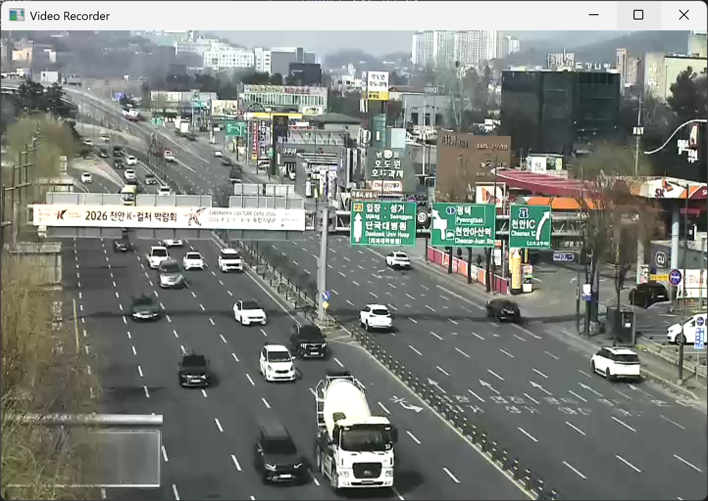
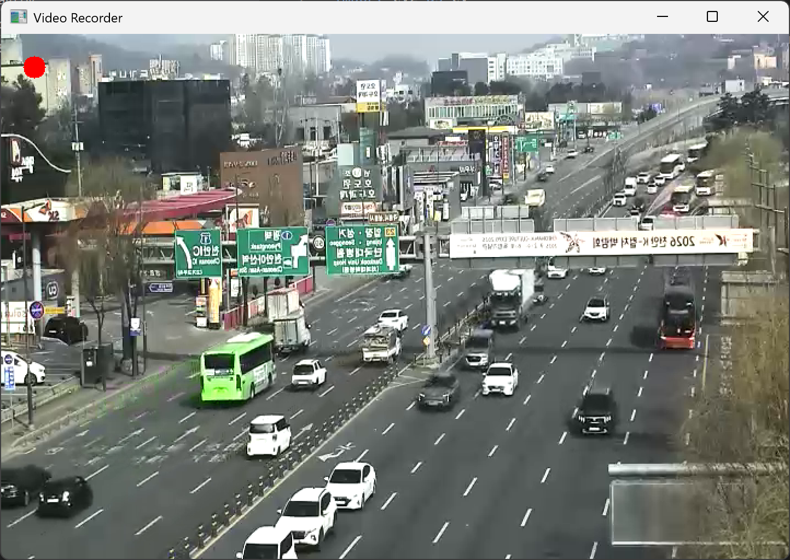
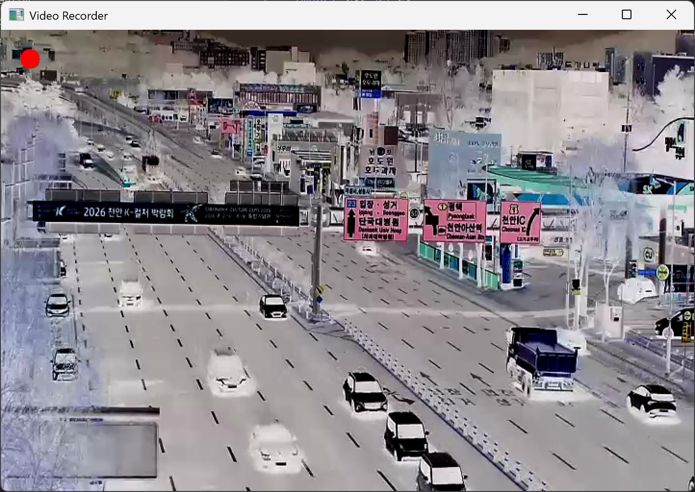
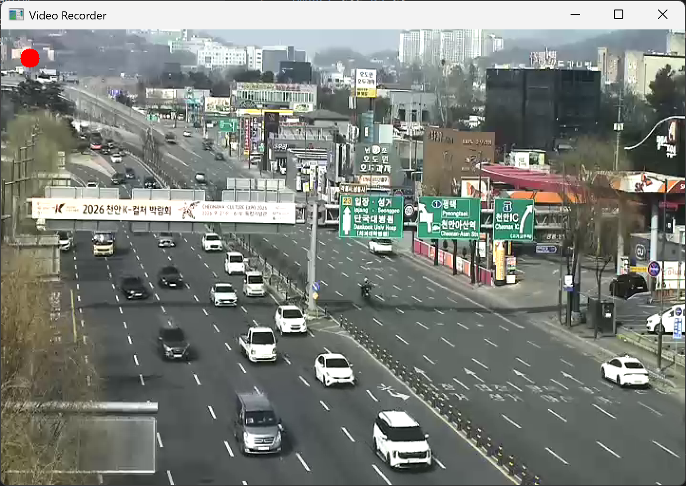

# CheonanTrafficRecorder
My simple video recorder using OpenCV for traffic CCTV

## 개요

본 프로그램은 OpenCV를 이용하여 교통 CCTV 영상(RTSP 스트림)을 실시간으로 받아와 화면에 출력하고, 사용자의 입력에 따라 영상을 녹화하는 비디오 레코더이다.

---

## 실행 환경

* Python 3.x
* OpenCV (`pip install opencv-python`)

---

## 파일 구성

* `main.py` : 비디오 레코더 프로그램 실행 코드
* `result1.png` : 원본 영상
* `result2.png` : 좌우 반전 영상
* `result3.png` : 색상 반전 영상
* `result4.png` : 녹화 상태 영상

---

## 조작 방법

| 키     | 기능             |
| ----- | -------------- |
| Space | 녹화 시작 / 종료     |
| F     | 좌우 반전 ON / OFF |
| N     | 색상 반전 ON / OFF |
| ESC   | 프로그램 종료        |

---

## 주요 기능

### 1. 실시간 영상 출력

OpenCV의 `cv.VideoCapture()`를 이용하여 CCTV 영상을 입력받아 화면에 출력한다.

---

### 2. 영상 녹화 기능

`cv.VideoWriter()`를 이용하여 현재 영상을 파일로 저장한다.
녹화 중에는 화면 좌측 상단에 빨간 원을 표시하여 녹화 상태를 확인할 수 있다.

---

### 3. 좌우 반전 (Flip)

`cv.flip()` 함수를 사용하여 영상을 좌우로 반전한다.

---

### 4. 색상 반전 (Negative Image)

`255 - pixel` 연산 또는 `cv.bitwise_not()`을 이용하여 색상을 반전한다.

---

## 영상 입력

### CCTV (RTSP) 사용(천안시 천안로삼거리)

```python id="n75g4t"
cap = cv.VideoCapture("rtsp://210.99.70.120:1935/live/cctv004.stream")
```

---

## 출력 파일

* 녹화 영상 파일: `record.avi`

---

## 📷 실행 결과

### 1. 원본 영상



### 2. 좌우 반전



### 3. 색상 반전



### 4. 녹화 상태 (빨간 점 표시)


